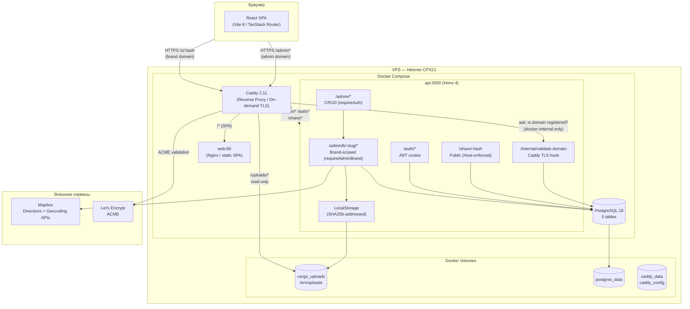
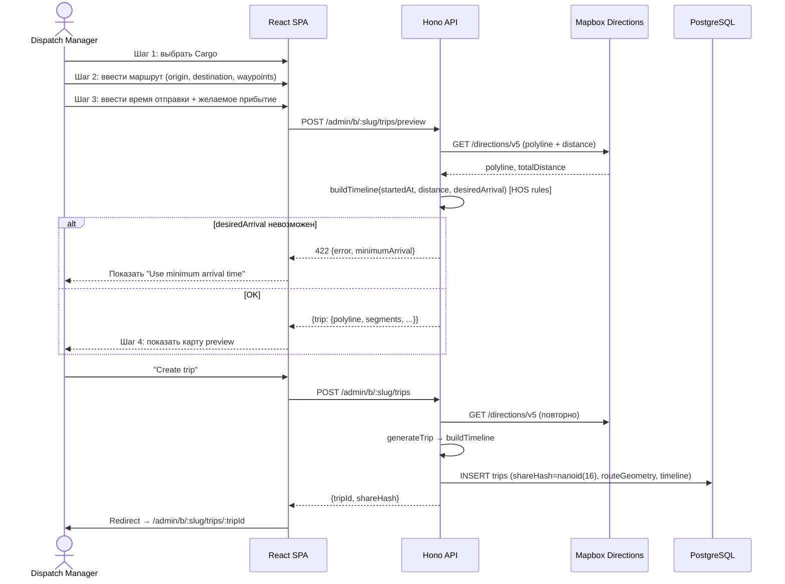
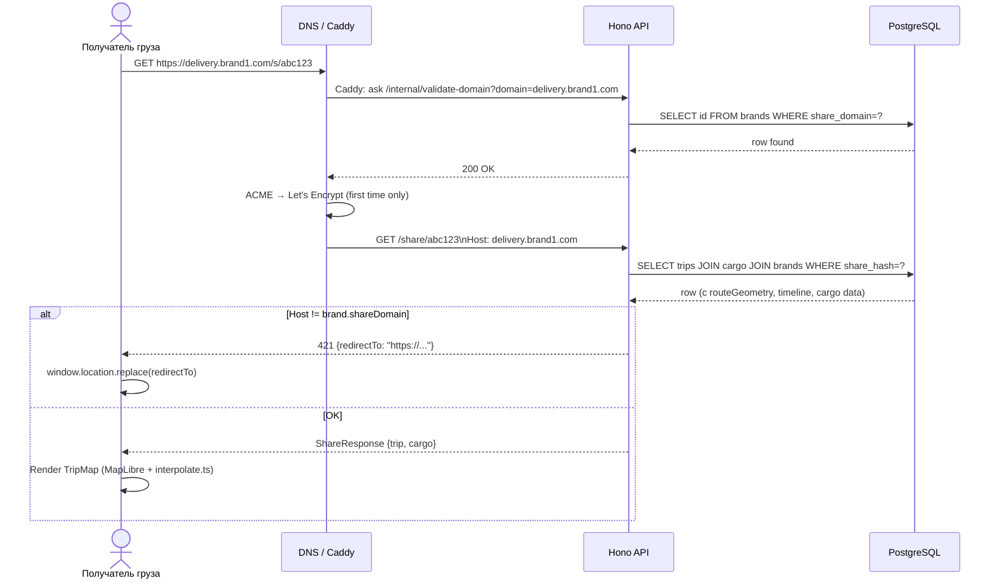
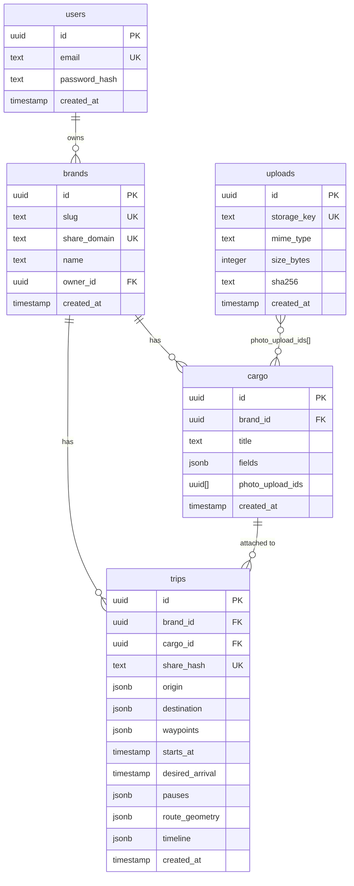
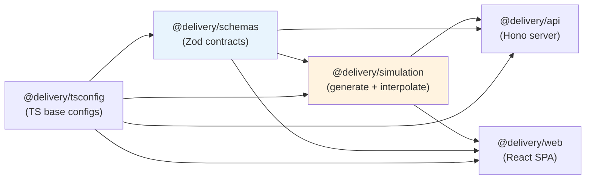

# Delivery Tracker — Architecture & Tech Stack

## Цель

Единое веб-приложение для трекинга доставки тяжёлых грузов, обслуживающее несколько брендов (`brand1.com`, `brand2.com`, …). Админ создаёт поездку в общей админке, система генерирует правдоподобный таймлайн движения по США/Канаде с учётом пауз водителя, клиент получает ссылку вида `delivery.brand1.com/{hash}` на брендированной share-странице.

## Ключевые архитектурные решения

1. **Таймлайн считается один раз при создании.** Симуляция движения — детерминированная функция `position(t)` по сохранённому набору сегментов. После генерации бэкенд в runtime практически не работает: только отдаёт JSON по hash и обслуживает админку.
2. **Один сервис, одна БД, один деплой.** Монолит, явное противопоставление прошлому опыту с distributed monolith. Никаких микросервисов, очередей, Kafka.
3. **Multi-tenant через on-demand TLS.** Каждый бренд настраивает CNAME на наш сервер; Caddy автоматически выпускает Let's Encrypt сертификат для каждого домена при первом запросе, валидируя его через API.
4. **Boring tech везде, где это не цена решения.** TypeScript end-to-end, Postgres, Docker Compose. Новизна тратится только на HOS-симуляцию и multi-tenant TLS.

## Технологический стек

### Backend
- **Runtime**: Node.js 24 LTS (Krypton)
- **Framework**: Hono 4.x — минималистичный HTTP-фреймворк с встроенной типизацией
- **ORM**: Drizzle ORM 0.45.x stable — type-safe, без магии, явные миграции. NB: команда ведёт ветку `1.0.0-beta.x`, для прода её не берём, пока не выйдет `1.0.0` final
- **Validation**: Zod 4.x — общий контракт между бэком и фронтом
- **Auth**: JWT в HTTP-only cookies для админки

### Frontend
- **Один SPA**: React 19 + Vite 8 + TanStack Router + TanStack Query 5 + Tailwind CSS 4 + shadcn/ui
- **Маршруты**: `/admin/*` — админка, `/s/:hash` — share-страница
- **Карты**: MapLibre GL JS 5.x на клиенте (форк Mapbox GL v1, бесплатный)
- **Code splitting**: route-based через TanStack Router; share-маршрут не должен тянуть админский код

### Карты и маршрутизация
- **Mapbox Directions API** — генерация маршрута на бэке (один вызов на поездку)
- **MapLibre GL JS** — рендеринг на клиенте
- **Тайлы**: Mapbox tiles (бесплатный лимит 50k загрузок/мес) либо MapTiler

### Инфраструктура
- **DB**: PostgreSQL 18
- **Reverse proxy**: Caddy 2.11+ с on-demand TLS
- **Container runtime**: Docker + Docker Compose
- **Hosting**: Hetzner CPX21 (отдельный VPS от Mailcow)
- **Storage (фото)**: локальный Docker volume (на старте), с абстракцией под будущую миграцию на S3/R2
- **Backup**: `restic` → Hetzner Storage Box (бэкапим Postgres dump + uploads volume)

### Деплой
- **Docker Context** — единая команда с локальной машины через SSH
- **Опционально**: локальный билд + `docker save | ssh | docker load`, если билд на VPS станет тяжёлым

### Tooling
- **Monorepo**: pnpm 10+ workspaces
- **Linting**: ESLint + Prettier
- **Type-checking**: tsc через project references

### Закреплённые версии (срез на апрель 2026)

Эти версии — отправная точка при `pnpm add` и проверке актуальности перед стартом. Обновлять блок раз в квартал.

| Технология | Версия | Заметка |
|------------|--------|---------|
| Node.js | 24 LTS | Krypton, активная LTS до апр. 2028. Node.js 20 LTS достигла EOL 30 апр. 2026 |
| pnpm | 10+ | |
| Hono | 4.12+ | |
| Drizzle ORM | 0.45.x | Стабильный канал. `1.0.0-beta.x` — не для прода, пока не выйдет финальный `1.0.0` |
| Zod | 4.x | TanStack Router интегрируется с Zod 4 нативно через `.default().catch()` |
| React | 19.2.x | |
| Vite | 8.x | Требует Node 20.19+ или 22.12+ — Node 24 окей |
| Tailwind CSS | 4.2.x | Конфигурация через CSS `@theme` директиву, не через `tailwind.config.js` |
| TanStack Query | 5.100.x | |
| TanStack Router | latest | Версии по дате релиза, не semver |
| MapLibre GL JS | 5.24.x | |
| PostgreSQL | 18 | образ `postgres:18-alpine` |
| Caddy | 2.11+ | образ `caddy:2.11`. on-demand TLS работает с 2.4+, но 2.11 содержит критичные security-фиксы (CVE-2026-2758x) |

## Целевая схема системы

```
Browser
  │
  ▼
Caddy (on-demand TLS)
  ├── /uploads/*  ─────────────► local volume (read-only mount)
  ├── /api/*      ─────────────► api:3000
  └── /*          ─────────────► web:80

API (Hono)
  ├── PostgreSQL
  ├── uploads volume (write)
  ├── @delivery/schemas
  └── @delivery/simulation/generate → Mapbox Directions API

Web (React SPA)
  ├── /admin/*  — кабинет администратора
  ├── /s/:hash  — share-страница
  ├── @delivery/schemas
  └── @delivery/simulation/interpolate → MapLibre GL JS
```

## Multi-tenancy

### Модель

Каждый бренд — строка в таблице `brands` с одним или несколькими доменами и темой оформления. Один админ-кабинет управляет всеми брендами; share-страницы рендерятся на доменах брендов.

### Поток подключения нового бренда

1. Админ добавляет бренд в кабинете: slug, домены, лого, цвета.
2. Владелец бренда настраивает DNS: `delivery.brand1.com` CNAME → `tracker.our-app.com`.
3. При первом запросе на новый домен Caddy спрашивает API: «домен в системе?» → API смотрит в `brands.shareDomain` → 200/404.
4. Если 200 — Caddy выпускает Let's Encrypt сертификат и запоминает.
5. Клиентские share-ссылки на этом домене начинают работать без перезапуска сервиса.

### Резолв на запросе

Middleware в API и web читает `Host` header → ищет в `brands` → кладёт `brandId` и тему в request context. Все запросы к данным фильтруются по `brandId`. Share-страница берёт цвета и лого из контекста бренда.

### Защита от Let's Encrypt rate-limit

`on_demand` TLS без валидации — стрельба себе в ногу: любой человек может натравить случайные домены и сжечь квоту. Поэтому endpoint `/internal/validate-domain?domain=...` обязателен и должен:
- Принимать запросы только из внутренней сети (от контейнера caddy)
- Отвечать 200 только если домен реально привязан к существующему бренду
- Логировать неуспешные попытки

## Иерархия и правила зависимостей

Зависимости между пакетами образуют DAG без циклов, строго в одну сторону:

```
Уровень 0 (фундамент):     schemas
                              ▲
                              │
Уровень 1:                 simulation
                              ▲
                              │
Уровень 2 (apps):          api, web
```

### Конкретные правила

```txt
schemas    → ни от кого
simulation → schemas (импортирует типы поездки/сегмента)
api        → schemas, simulation/generate
web        → schemas, simulation/interpolate
```

### Запрещено

- Цикл (например, `schemas` импортирует из `simulation`)
- Обратное направление (`simulation` импортирует из `api`)
- Импорт `apps/*` из `packages/*`

### Почему `schemas` — фундамент

Это API-контракт: Zod-схемы и выводимые из них TS-типы. Бэк валидирует ими входящие запросы, фронт использует для форм и автодополнения. Дублировать сущности типа `Trip` в нескольких местах — гарантированный путь к рассинхронизации.

**Важно**: схемы из `packages/schemas` — это API-контракт, **не БД-схема**. Drizzle-схема живёт в `apps/api/src/db/schema.ts` и описывает таблицы. Они похожи, но не должны быть одним и тем же: в БД может быть `created_at`, которое наружу не торчит; API может содержать computed fields, которых нет в БД.

### Экспорты `simulation`

`generate.ts` — Node-only (Mapbox, FS). `interpolate.ts` — browser-safe. Физическое разделение через subpath exports (`./generate`, `./interpolate`). ESLint `no-restricted-imports` в `apps/web` блокирует случайный импорт Node-кода в браузер.

## Storage

### Абстракция

```ts
// apps/api/src/storage/types.ts
export interface Storage {
  put(key: string, data: Buffer, mime: string): Promise<void>
  url(key: string): string
  delete(key: string): Promise<void>
}
```

Реализация `LocalStorage` пишет в `STORAGE_ROOT` и формирует host-relative URL вида `/uploads/${key.slice(0,2)}/${key}` (не абсолютный — так он работает для любого домена без утечки admin-домена на share-страницы). `STORAGE_DRIVER` и `R2Storage` запланированы, но не реализованы: `storage/index.ts` всегда создаёт `new LocalStorage(env.STORAGE_ROOT)`.

### Именование файлов

Имя файла — `{sha256}.{ext}`. Это даёт две вещи: безопасный `Cache-Control: immutable` (содержимое по ключу не меняется) и автоматическая дедупликация одинаковых загрузок.

### Отдача файлов

Caddy раздаёт статику напрямую через `handle_path /uploads/*` с read-only mount общего volume. Бэкенд не тратит event loop на отдачу JPEG'ов.

## Деплой

### Принцип

Никакого CI/CD на старте. Локальная машина → Docker Context → удалённый docker daemon по SSH.

### Первичная настройка

```bash
docker context create delivery-prod \
  --docker "host=ssh://root@SERVER_IP"
```

### Стандартный цикл

```bash
pnpm lint && pnpm typecheck && pnpm test
pnpm deploy
pnpm db:migrate:prod   # если есть новые миграции
pnpm logs
```

## Backup

Минимально:
- `postgres_data` → ежедневный `pg_dump` через cron на сервере → `restic` push в Hetzner Storage Box
- `cargo_uploads` → ежедневный `restic` snapshot volume в то же Storage Box
- Retention: 7 дней daily, 4 недели weekly

## Что отложено

- **Cloudflare R2 для фото**: на старте локальный volume. Триггеры миграции — объём > 10–20 ГБ или необходимость нескольких инстансов API.
- **Astro для отдельной share-страницы**: один `apps/web` достаточен. Триггер миграции — share-bundle перевалит за ~300KB gzipped или появится потребность в SSR (Open Graph для шаринга в мессенджерах).
- **Turborepo**: `pnpm -r run build` справляется до 5–6 пакетов. Подключать, когда время сборки начнёт раздражать.
- **CI/CD pipeline, registry, GitHub Actions**: не нужны для соло-разработчика на этом этапе. Деплой через Docker Context — оптимальный trade-off.
- **Realtime-обновления share-страницы**: не нужны, потому что таймлайн детерминированный. Если когда-нибудь админу понадобится «вмешиваться» в поездку (задержки, форс-мажор) — добавится patch-эндпоинт и SSE.

---

## Диаграммы системы

> Актуальное состояние на 2026-05-07.

### Компонентная диаграмма



### Поток создания Trip



### Поток открытия Share Page



### Модель данных (ER)



### Пакетная DAG (monorepo)



**Правило**: зависимости строго снизу вверх. `generate.ts` — Node-only (Mapbox API). `interpolate.ts` — browser-safe.
