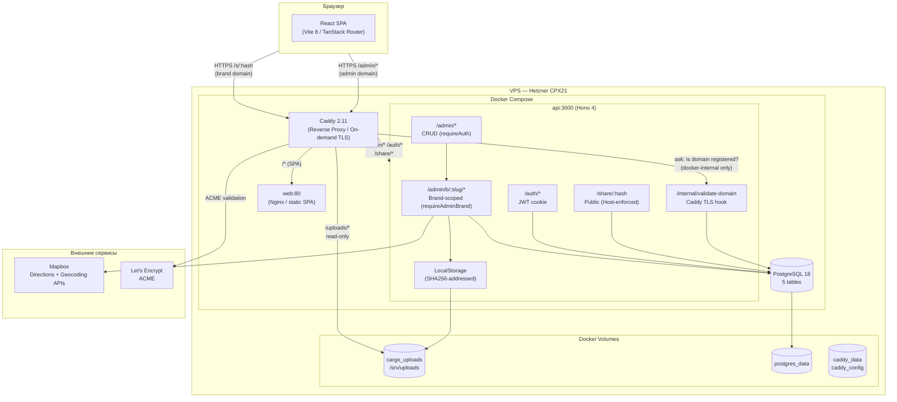
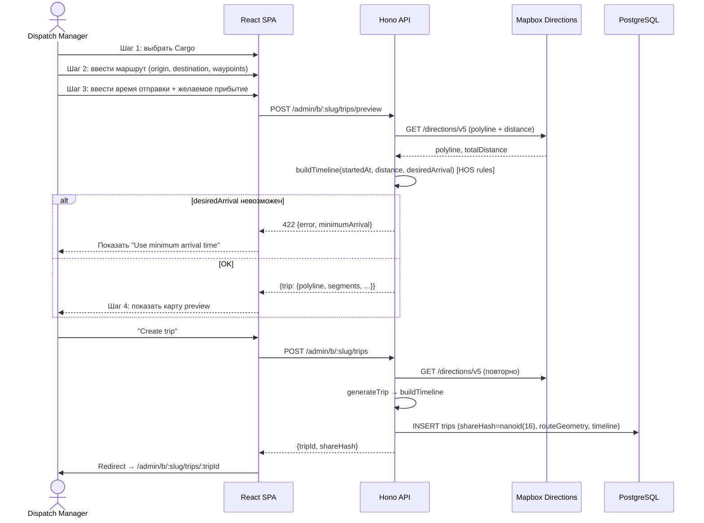
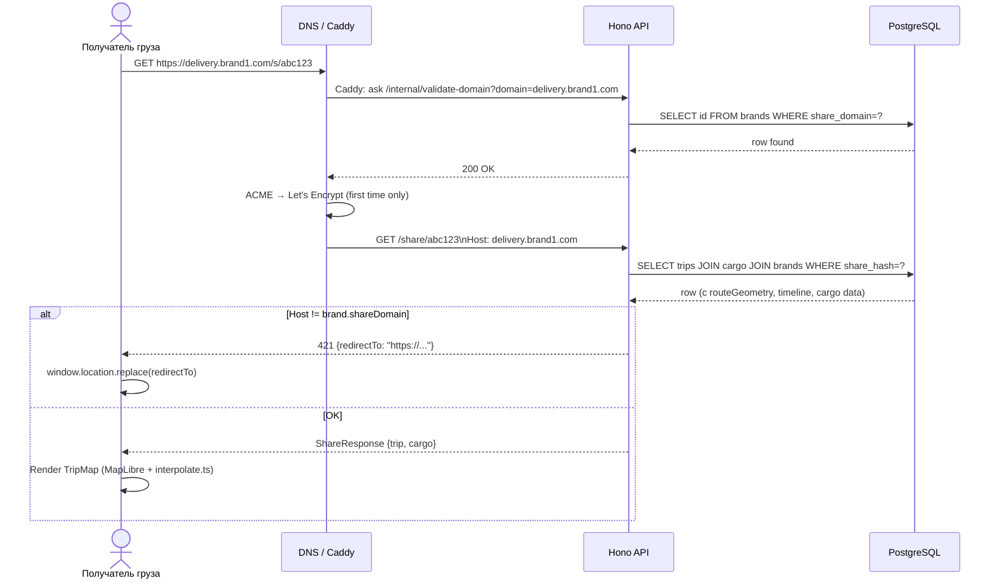
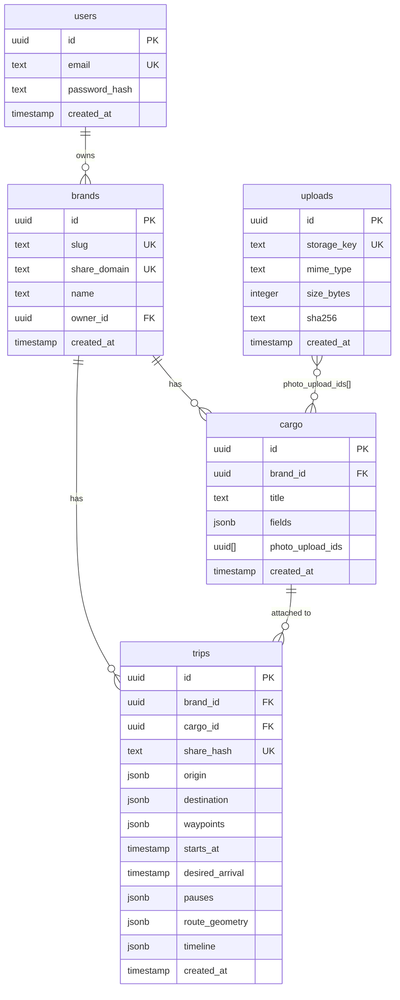
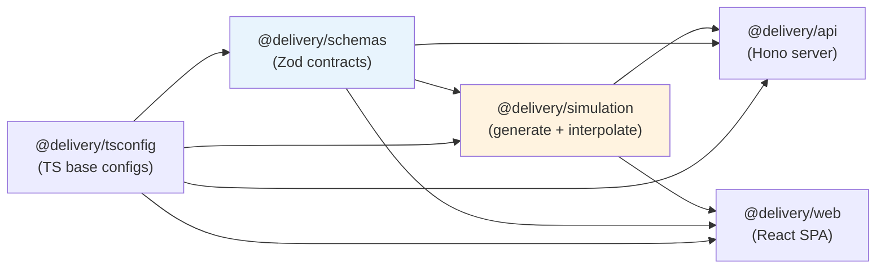

# System Architecture Diagram

> Актуальное состояние на 2026-05-07. Воспроизведено из кода (Architecture Designer).

---

## Компонентная диаграмма



---

## Поток создания Trip



---

## Поток открытия Share Page



---

## Модель данных



---

## Пакетная DAG (monorepo)



**Правило**: зависимости строго снизу вверх. `generate.ts` — Node-only (Mapbox API). `interpolate.ts` — browser-safe.
```
