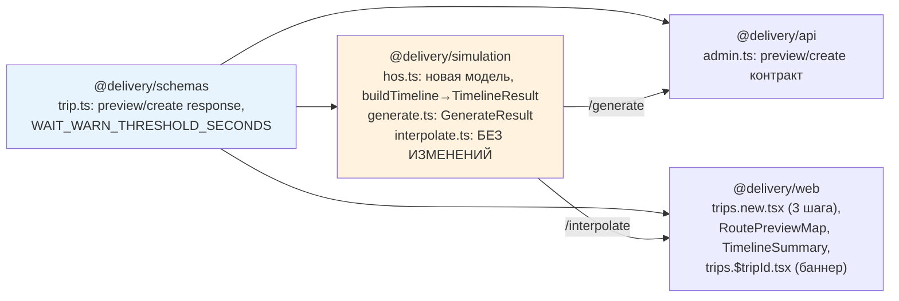

# Design Document

> Эпик: `delivery-tracker-v2-ym6`. Источник истины — `specs/trip-wizard-redesign/requirements.md` (8 requirements, 3 NFR, 5 Resolved Decisions). Каждый раздел дизайна ссылается на требования по ID, например `[R4 AC1]`, `[NFR-1]`.

## Overview

Изменение состоит из двух связанных частей поверх неизменного ядра детерминизма (`interpolate.ts`).

**Расчётная часть.** FMCSA-каркас симуляции (`packages/simulation/src/hos.ts`) заменяется упрощённой моделью «рабочий день»: ~8 ч вождения с 3–4 случайными короткими паузами `break` (10–20 мин), затем детерминированный сон `sleep` 10 ч; цикл повторяется до прибытия [R6]. Средняя скорость снижается с 80 км/ч до **50 км/ч** (середина допустимого диапазона 40–60 км/ч) [R5]. Семантика `desiredArrival` меняется с «не позже» на «не раньше»: ранний приезд гасится хвостовым `wait`-сегментом, поздний — это информационный флаг, а не ошибка [R4]. Из кода удаляются `solveMaxDistance`, `driveWithFuel`, ветка `'too_slow'` у `HosError`, константы смен и топлива [R6 AC7]. `buildTimeline` перестаёт бросать `HosError` для «не успеваю» — вместо этого возвращает структуру `{ segments, minArrival, lateArrival }` [R8 AC5].

**UX-часть.** Действующий четырёхшаговый визард `Cargo → Route → Time → Preview` превращается в трёхшаговый `Cargo → Timing → Route` [R1]. На третьем шаге маршрут и timeline пересчитываются в реальном времени (debounce 600 мс + `AbortController`) и рисуются на карте справа от формы; отдельного экрана подтверждения нет [R3, NFR-2]. Ранний приезд показывается как явное предупреждение о простое (с градацией по порогу `WAIT_WARN_THRESHOLD_SECONDS = 5400`), поздний — как ненавязчивое advisory; обе ситуации не блокируют создание [R3 AC9–AC11, OQ-E].

**Ключевые архитектурные решения и их обоснование.**
1. **`Math.random()` только на пути генерации (Node-only).** Случайность инъецируется в `buildTimeline(..., rng = Math.random)`; единственный production-вызов — `generateTrip` (subpath `@delivery/simulation/generate`, Node-only). `interpolate.ts` (`@delivery/simulation/interpolate`, browser-safe) не импортирует `hos.ts` и не вызывает RNG — инвариант `[NFR-1]` сохраняется по построению.
2. **Preview и create — независимые генерации.** Это уже так (две независимые `getRoute`+`buildTimeline`). С рандомными паузами preview становится *иллюстративным*; авторитетный timeline создаётся и сохраняется при `POST /trips`, а его `lateArrival/minimumArrival` возвращаются в ответе create и показываются на детальной странице (см. [§ Критический вопрос](#критический-вопрос-preview-vs-persisted-timeline)).
3. **Без миграции БД.** `timeline` — это `jsonb`; старые записи с `reason: 'fuel' | 'break' | 'sleep'` остаются валидными (enum не сужается) и продолжают корректно интерполироваться [R8 AC3, NFR-1].

Дизайн строго укладывается в DAG монорепы (`schemas → simulation → {api, web}`): меняются `schemas` (контракт), `simulation/hos.ts` (ядро), `api/admin.ts` (эндпоинты), `web` (визард, карта, детальная страница). `interpolate.ts` не трогается.

---

## Architecture

### Затронутые пакеты и направление зависимостей



Правила DAG соблюдены: `simulation` зависит только от `schemas`; `api` использует `simulation/generate` (Node-only, Mapbox+RNG); `web` использует `simulation/interpolate` (browser-safe, без RNG) [архитектура README §Иерархия].

### Поток данных: живой preview + create

```mermaid
sequenceDiagram
    actor DM as Dispatch Manager
    participant Web as Шаг 3 (Route)
    participant API as POST /trips/preview
    participant Sim as generate→buildTimeline (rng=Math.random)
    participant Mapbox

    Note over Web: origin+destination resolved → debounce 600мс
    DM->>Web: правка маршрута/waypoint
    Web->>Web: clearTimeout + abort предыдущего; новый таймер
    Web->>API: POST preview (resolved-only waypoints, AbortController.signal)
    API->>Sim: generateTrip(input)
    Sim->>Mapbox: getRoute()
    Mapbox-->>Sim: polyline, totalDistance
    Sim->>Sim: buildTimeline → {segments, minArrival, lateArrival}
    Sim-->>API: GenerateResult
    alt minArrival > desiredArrival (поздно)
        API-->>Web: 200 {trip, lateArrival:true, minimumArrival}
        Web-->>DM: advisory «прибудет позже окна» (не блокирует)
    else minArrival <= desiredArrival (рано/вовремя)
        API-->>Web: 200 {trip, lateArrival:false}  (есть хвостовой wait при slack>0)
        Web-->>DM: карта + timeline-summary + предупреждение о простое (wait)
    end
    DM->>Web: «Create trip»
    Web->>API: POST /trips
    API->>Sim: generateTrip (новый рандом → новые break-паузы)
    API->>API: INSERT trips(timeline=segments)
    API-->>Web: 201 {tripId, shareHash, lateArrival, minimumArrival?}
    Web->>Web: redirect → /trips/:tripId (баннер при lateArrival)
```

### Инварианты (подтверждение)

- **I1 — детерминизм чтения [NFR-1, R7].** `interpolatePosition(trip, t)` читает только `trip.segments`; ни RNG, ни внешних вызовов. `interpolate.ts` не меняется и не импортирует `hos.ts`.
- **I2 — рандом один раз, при создании [R7 AC1].** Короткие `break`-паузы рисуются `Math.random()` ровно один раз в `generateTrip` (создание/preview), затем сериализуются явными `Segment`-объектами в `segments`/`timeline`. `sleep` детерминирован.
- **I3 — последний сегмент кончается в нужный момент.** Если `minArrival < desiredArrival` — хвостовой `wait` доводит конец до `desiredArrival` [R4 AC1/AC7]; если `>=` — таймлайн кончается в `minArrival`.

### Масштабируемость / производительность

Симуляция — O(числа сегментов) ≤ ~16 дней × (≤5 сегментов/день) — пренебрежимо мала. Узкое место — вызовы Mapbox Directions; их частоту ограничивает debounce 600 мс + один `AbortController` на сессию (≤1 параллельный запрос) [NFR-2]. Карта lazy-loaded, summary рисует skeleton при загрузке [NFR-3].

---

## Components and Interfaces

### 1. Ядро симуляции — `packages/simulation/src/hos.ts`

#### 1.1 Константы (итоговый набор)

```ts
// Средняя скорость. 50 км/ч — середина допустимого диапазона [40,60]; реалистична
// для гружёного тягача с учётом городских участков и заторов [R5 AC1].
const TRUCK_AVG_SPEED_KMH = 50
// Стартовый guard: при значении вне [40,60] падаем на загрузке модуля. hos.ts
// импортируется через generate.ts на старте API → это эффективно startup-check [R5 AC4].
if (TRUCK_AVG_SPEED_KMH < 40 || TRUCK_AVG_SPEED_KMH > 60) {
  throw new Error(
    `TRUCK_AVG_SPEED_KMH must be within [40,60] km/h for a realistic timeline, got ${TRUCK_AVG_SPEED_KMH}`,
  )
}
export const TRUCK_AVG_SPEED_MS = (TRUCK_AVG_SPEED_KMH * 1000) / 3600 // ≈ 13.889 m/s

export const DRIVING_DAY_SECONDS = 8 * 3600 // 28 800 — бюджет вождения на «день» [R6 AC4]
export const SLEEP_DURATION = 10 * 3600 // 36 000 — фикс. сон после дня, RETAINED [R6 AC7]

// Параметры коротких пауз [R6 AC1/AC2]
export const MIN_PAUSE_SECONDS = 10 * 60 // 600
export const MAX_PAUSE_SECONDS = 20 * 60 // 1200
const FIRST_PAUSE_MIN_OFFSET = 30 * 60 // 1800 — первая пауза не в первые 30 мин вождения
const MIN_DRIVE_BETWEEN_PAUSES = 15 * 60 // ≥1 driving-подсегмент между паузами (не смежные)
const PAUSE_TAIL_MARGIN = 15 * 60 // после последней паузы остаётся вождение (не смежна со сном/концом)
```

**Удаляется полностью** [R6 AC7]: `GOVERNED_TOP_SPEED`, `ROAD_CLASS_FACTOR`, `MAX_DRIVE_BEFORE_BREAK`, `BREAK_DURATION`, `MAX_DRIVE_PER_SHIFT`, `MAX_ONDUTY_WINDOW`, `SLEEP_DURATION_MAX`, `FUEL_RANGE`, `FUEL_STOP_DURATION`, `MAX_SOLVER_ITERATIONS`; функции `solveMaxDistance`, `driveWithFuel`, `distributeSlack`; ветка `'too_slow'` и поля `direction/maximumArrival` у `HosError`.

#### 1.2 `HosError` (упрощается)

```ts
// Бросается ТОЛЬКО при внутренних assertion-сбоях (например, нулевая/невозможная
// геометрия), НЕ при minArrival > desiredArrival и НЕ для удалённого 'too_slow' [R8 AC5].
export class HosError extends Error {
  readonly minimumArrival: number
  constructor(message: string, minimumArrival: number) {
    super(message)
    this.name = 'HosError'
    this.minimumArrival = minimumArrival
  }
}
```

`minimumArrival` оставлен в сигнатуре для обратной совместимости тестов/читателей, но в новой модели late-arrival не бросает ошибку. Внутренний assertion-кейс (см. § Error Handling) может передавать `minimumArrival = startedAt`.

#### 1.3 Контракт `buildTimeline` (новый возврат)

Сейчас `buildTimeline` возвращает `Segment[]` и бросает `HosError`. API нужен `minArrival` *до* добавления `wait` и флаг `lateArrival`. Поэтому функция возвращает структуру:

```ts
export interface TimelineResult {
  /** Полный таймлайн: driving + break + sleep, плюс хвостовой wait при раннем приезде. */
  segments: Segment[]
  /** Unix-сек, момент прибытия в минимальном таймлайне (tEnd последнего НЕ-wait сегмента),
   *  округлён вверх до целой секунды. Это «earliest reachable arrival». */
  minArrival: number
  /** true ⇔ minArrival > desiredArrival (приедет позже желаемого окна) [R4 AC2]. */
  lateArrival: boolean
}

export function buildTimeline(
  startedAt: number,
  totalDistance: number,
  desiredArrival: number,
  rng: () => number = Math.random, // инъекция RNG; production использует Math.random [R7 AC1]
): TimelineResult
```

Псевдокод:

```text
buildTimeline(startedAt, totalDistance, desiredArrival, rng):
  if totalDistance <= 0 or polyline degenerate:
    throw HosError("assertion: non-positive trip distance", startedAt)   # внутренний кейс [R8 AC5]

  minimum = simulateMinimum(startedAt, totalDistance, rng)   # Segment[] (driving/break/sleep)
  rawMinArrival = minimum.last.tEnd
  minArrival = ceil(rawMinArrival)                            # int sec, безопасно отдавать наружу

  if rawMinArrival > desiredArrival:                          # поздно — не ошибка [R4 AC2]
    return { segments: minimum, minArrival, lateArrival: true }

  slack = desiredArrival - rawMinArrival                      # >= 0
  segments = slack > 0 ? appendWait(minimum, slack) : minimum # любой положительный slack → wait [R4 AC1/AC7]
  return { segments, minArrival, lateArrival: false }
```

Ключевое отличие от старой `distributeSlack`: **никакого распределения slack по снам и никакого `SLEEP_DURATION_MAX`**. Любой положительный slack целиком уходит в **один** хвостовой `wait` — даже для короткой одно-сегментной поездки (старый «short trip: no wait» контракт отменён) [R4 AC7].

```text
appendWait(segments, slack):
  last = segments.last
  atDist = last.type === 'driving' ? last.distEnd : last.atDist
  wait = { type: 'rest', tStart: last.tEnd, tEnd: last.tEnd + slack, atDist, reason: 'wait' }
  return [...segments, wait]                                  # last.tEnd == desiredArrival ровно
```

#### 1.4 `simulateMinimum` — цикл «рабочий день → сон»

```text
simulateMinimum(startedAt, totalDistance, rng):
  segments = []
  t = startedAt
  dist = 0
  EPS = 0.01

  while dist < totalDistance - EPS:
    remainingDriveSec = (totalDistance - dist) / TRUCK_AVG_SPEED_MS
    dayDriveSec = min(DRIVING_DAY_SECONDS, remainingDriveSec)   # бюджет вождения этого дня

    pausePlan = planDayPauses(dayDriveSec, rng)   # отсортированные offset'ы (в driving-сек) + длительности
    drivenInDay = 0
    for (offset, pauseDur) in pausePlan:
      seg = makeDriving(t, dist, totalDistance, offset - drivenInDay)  # доедем до точки паузы
      push seg; t = seg.tEnd; dist = seg.distEnd; drivenInDay = offset
      push { type:'rest', tStart:t, tEnd:t+pauseDur, atDist:dist, reason:'break' }  # пауза НЕ бьётся по driving-бюджету [R6 AC3]
      t += pauseDur
    # доезжаем остаток дневного бюджета
    seg = makeDriving(t, dist, totalDistance, dayDriveSec - drivenInDay)
    push seg; t = seg.tEnd; dist = seg.distEnd

    if dist >= totalDistance - EPS: break          # доехали в этот день → сна нет [R6 AC8]
    push { type:'rest', tStart:t, tEnd:t+SLEEP_DURATION, atDist:dist, reason:'sleep' }  # сон после дня [R6 AC4/AC5]
    t += SLEEP_DURATION

  return segments
```

`makeDriving` сохраняется как есть (линейный driving-сегмент по `TRUCK_AVG_SPEED_MS`, clamp по `totalDistance`). Свойства модели:
- Короткие паузы и сон **не** вычитаются из driving-бюджета → суммарное вождение = `totalDistance / TRUCK_AVG_SPEED_MS` независимо от пауз [R6 AC3/AC5].
- Никаких 11-ч/14-ч лимитов, обязательного 30-мин break, fuel-стопов — модель применяется единообразно на всю длину поездки [R6 AC6].
- Сегменты для новой поездки: `driving`, `break`, `sleep` (после каждого не-последнего дня) и опц. хвостовой `wait`; `fuel` не генерируется [R6 AC8].

#### 1.5 `planDayPauses` — генерация коротких пауз

Размещение через равномерные «интервалы» с рандом-сдвигом — это автоматически даёт 3–4 паузы на полный день и плавное прореживание на коротком последнем дне.

```text
planDayPauses(dayDriveSec, rng):
  if dayDriveSec <= FIRST_PAUSE_MIN_OFFSET: return []   # слишком короткий день — без пауз

  N = 3 + floor(rng() * 2)                              # 3 или 4 [R6 AC1]
  interval = DRIVING_DAY_SECONDS / (N + 1)              # шаг привязан к ПОЛНОМУ дню
  jitter = interval * 0.4                               # «примерно равномерно с рандом-сдвигом» [R6 AC2]

  result = []
  prevOffset = 0
  k = 1
  while k * interval <= dayDriveSec - PAUSE_TAIL_MARGIN:
    nominal = k * interval
    offset = nominal + (rng() * 2 - 1) * jitter
    # инварианты: первая не в первые 30 мин; не смежные; есть вождение после последней
    offset = clamp(offset,
                   max(FIRST_PAUSE_MIN_OFFSET, prevOffset + MIN_DRIVE_BETWEEN_PAUSES),
                   dayDriveSec - PAUSE_TAIL_MARGIN)
    if offset <= prevOffset: break                      # места не осталось
    durMinutes = 10 + floor(rng() * 11)                 # uniform int [10..20] мин [R6 AC1]
    result.push({ offset, duration: durMinutes * 60 })
    prevOffset = offset
    k += 1

  return result
```

Гарантии (проверяются тестами): на полном дне (`dayDriveSec == DRIVING_DAY_SECONDS`) → ровно 3 (N=3) или 4 (N=4) паузы; `offset[0] >= FIRST_PAUSE_MIN_OFFSET`; между соседними ≥ `MIN_DRIVE_BETWEEN_PAUSES` вождения (не смежные); после последней паузы ещё есть driving (`offset[last] <= dayDriveSec - PAUSE_TAIL_MARGIN`), значит `break` не примыкает к `sleep`/концу; каждая длительность ∈ {600, 660, …, 1200}.

#### 1.6 Где живёт `Math.random` [R7 AC1, NFR-1]

RNG инъецируется параметром `rng` в `buildTimeline`/`planDayPauses`. **Единственный production-источник** — дефолт `Math.random` внутри `hos.ts`, который вызывается только когда `generateTrip` (Node-only) строит таймлайн при preview/create. `interpolate.ts` не импортирует `hos.ts`, поэтому RNG физически недоступен в браузере. Тесты подменяют `rng` детерминированной последовательностью.

---

### 2. Критический вопрос: preview vs persisted timeline

**Проблема.** `buildTimeline` использует `Math.random` для коротких пауз. Preview (`POST /trips/preview`) и финальное создание (`POST /trips`) — две независимые генерации, поэтому дадут **разные** короткие паузы и слегка разный `minArrival`/`wait`. На день вождения суммарное время `break` варьируется в диапазоне `[3×10, 4×20] = [30, 80]` мин; для типичной поездки ≤2 дней неопределённость `minArrival` < ~1 ч (обычно меньше, т.к. матожидания близки).

**Рассмотренные варианты.**

| Вариант | Суть | Вердикт |
|---|---|---|
| (а) Принять расхождение | Паузы в preview иллюстративны; авторитетный таймлайн генерируется и сохраняется при create | **Рекомендуется** |
| (б) Детерминированный preview | В preview считать фиксированный «представительный» break-бюджет (или опускать паузы), показывать только агрегатный вклад | Отклонён: противоречит рандому из [R6 AC1] и всё равно расходится с сохранённым |
| (в) Передавать паузы из preview в create | Клиент возвращает сгенерированный timeline/seed на сервер | Отклонён: ломает модель «create регенерирует из inputs», раздувает тело запроса, создаёт surface доверия/валидации (клиент может подделать timeline) |

**Рекомендация — вариант (а)** со следующими уточнениями, снимающими риски:

1. **Внутренняя согласованность одного ответа.** Preview возвращает *те же* `segments`, по которым посчитаны `lateArrival/minimumArrival` и хвостовой `wait`. Карта, timeline-summary и предупреждение в одном ответе всегда согласованы между собой; расхождение существует только между preview-ответом и в итоге сохранённой поездкой.
2. **Источник истины — create.** `POST /trips` возвращает свои авторитетные `lateArrival/minimumArrival` [R4 AC5], а детальная страница показывает баннер из сохранённого таймлайна [R8 AC6]. Пользователь после создания всегда видит реальное состояние.
3. **Копирайтинг.** На шаге 3 числа подаются как оценка («ожидаемое прибытие», «≈ простой»); предупреждения не блокируют создание [R3 AC9–AC11].

**Влияние на [NFR-1].** Нулевое: NFR-1 — про детерминизм *чтения* из сохранённых `segments`, а не про повторный запуск генератора. Чтение всегда детерминировано (I1). Расхождение preview↔create — это «генерация vs генерация», что NFR-1 явно разрешает.

**Влияние на порог 1.5 ч (`WAIT_WARN_THRESHOLD_SECONDS`).** Граничный риск: рандомный разброс break-времени (до ~50 мин/день) может на краю перевести `wait` через порог 5400 с или переключить `lateArrival` между preview и create. Это принято как допустимое, потому что: (i) разброс ограничен и для коротких поездок мал; (ii) детальная страница после create показывает фактическую градацию; (iii) предупреждения в любом случае не блокируют. Альтернативное «жёсткое» решение (фиксировать суммарный break-бюджет) сознательно отклонено как противоречащее [R6 AC1].

---

### 3. `generate.ts` — контракт генерации

```ts
export interface GenerateResult {
  trip: Trip
  minArrival: number   // unix sec (из TimelineResult)
  lateArrival: boolean
}

export async function generateTrip(
  input: GenerateTripInput | TripPreviewInput,
  opts: { mapboxToken: string },
): Promise<GenerateResult>
```

Псевдокод:

```text
generateTrip(input, { mapboxToken }):
  { polyline, totalDistance } = await getRoute(input.origin, input.destination, input.waypoints, mapboxToken)
  startedAt = floor(input.startedAt)
  desiredArrival = floor(input.desiredArrival)
  { segments, minArrival, lateArrival } = buildTimeline(startedAt, totalDistance, desiredArrival)  # rng=Math.random
  return {
    trip: { startedAt, polyline, totalDistance, segments, pauses: [] },
    minArrival,
    lateArrival,
  }
```

`HosError` реэкспортируется как раньше (`export { HosError } from './hos.js'`).

---

### 4. Схемы — `packages/schemas/src/trip.ts`

#### 4.1 `RestSegmentSchema` — без изменений

Enum уже содержит `['sleep', 'break', 'fuel', 'wait']`. Все четыре значения остаются: `break`/`sleep`/`wait` генерируются для новых поездок, `fuel` сохраняется ради совместимости со старыми записями [R8 AC3, NFR-1]. **Структурных изменений в схеме сегмента не требуется.**

#### 4.2 Новый порог простоя (shared)

```ts
// Порог «красного» предупреждения о простое у точки выгрузки [R3 AC11, OQ-E].
// В schemas, чтобы web (и при желании api) ссылались на единый источник.
export const WAIT_WARN_THRESHOLD_SECONDS = 5400 // 1.5 ч
```

#### 4.3 Ответ preview (новая схема)

`desiredArrival`-семантика «не раньше»: 422 за поздний приезд убирается; вместо этого 200 с флагом. Дискриминированное объединение точно выражает «`minimumArrival` присутствует ⇔ `lateArrival === true`» [R4 AC3/AC4, R8 AC1/AC2]:

```ts
export const TripPreviewResponseSchema = z.discriminatedUnion('lateArrival', [
  z.object({ trip: TripSchema, lateArrival: z.literal(false) }),
  z.object({ trip: TripSchema, lateArrival: z.literal(true), minimumArrival: z.number().int() }),
])
export type TripPreviewResponse = z.infer<typeof TripPreviewResponseSchema>
```

Поле `earlyBySeconds` намеренно не вводится: клиент берёт длительность простоя напрямую из последнего сегмента с `reason: 'wait'` [R3 AC10, OQ-E]. (Может быть добавлено позже как опциональное, без поломки контракта.)

#### 4.4 Ответ create (новая схема)

```ts
export const TripCreateResponseSchema = z.discriminatedUnion('lateArrival', [
  z.object({ tripId: z.uuid(), shareHash: z.string(), lateArrival: z.literal(false) }),
  z.object({
    tripId: z.uuid(),
    shareHash: z.string(),
    lateArrival: z.literal(true),
    minimumArrival: z.number().int(),
  }),
])
export type TripCreateResponse = z.infer<typeof TripCreateResponseSchema>
```

[R4 AC5, R8].

#### 4.5 Без изменений

`GenerateTripInputSchema`, `TripPreviewInputSchema`, `withinArrivalWindow`, `MAX_ARRIVAL_WINDOW_SECONDS`, `TripSchema`, `TripAdminSchema`, `LatLngSchema`, `LineStringSchema` — не меняются [R8 AC4]. `withinArrivalWindow` по-прежнему: `desiredArrival` строго после `startedAt` и в пределах 14 дней → иначе 422/400 на входе [R4 AC6]. `TripAdminSchema` не расширяется: `lateArrival`/ранний простой на детальной странице **выводятся** из `trip.segments` + `desiredArrival` (см. §7).

---

### 5. API — `apps/api/src/routes/admin.ts`

#### 5.1 `POST /trips/preview`

```text
preview handler:
  if !MAPBOX_TOKEN: return 503 { error }
  input = validated(TripPreviewInputSchema)          # 400 на нарушении окна [R4 AC6]
  { trip, minArrival, lateArrival } = await generateTrip(input, { mapboxToken })
  if lateArrival:
    return 200 { trip, lateArrival: true, minimumArrival: minArrival }   # НЕ 422 [R4 AC3, R8 AC1]
  else:
    return 200 { trip, lateArrival: false }                              # без minimumArrival [R4 AC4, R8 AC2]
```

`HosError` больше не ловится как 422-«поздно». Если `generateTrip` бросит `HosError` (внутренний assertion) — это 500 (общий обработчик), не часть нормального потока [R8 AC5]. Ответ опционально валидируется `TripPreviewResponseSchema` перед отдачей (как и в других эндпоинтах через `*.parse`).

#### 5.2 `POST /trips`

```text
create handler:
  if !MAPBOX_TOKEN: return 503
  input = validated(GenerateTripInputSchema)          # 400 на нарушении окна
  cargo = tenantDb(brand).cargo.byId(input.cargoId); if !cargo: return 404
  { trip, minArrival, lateArrival } = await generateTrip(input, { mapboxToken })
  shareHash = nanoid(16)
  inserted = tenantDb(brand).trips.insert({
    ..., routeGeometry: trip.polyline, timeline: trip.segments,   # явные Segment-объекты до commit [R6 AC9, R7 AC2]
    totalDistanceMeters: round(trip.totalDistance),
  })
  if lateArrival:
    return 201 { tripId, shareHash, lateArrival: true, minimumArrival: minArrival }  # [R4 AC5]
  else:
    return 201 { tripId, shareHash, lateArrival: false }
```

`minArrival` отдаётся «до добавления `wait`» — это поле `TimelineResult.minArrival` (для раннего/вовремя оно ≤ `desiredArrival` и в ответе отсутствует; для позднего — это `tEnd` последнего сегмента, т.к. `wait` не добавляется). Таким образом отдельную функцию ради `minArrival` городить не нужно — он уже возвращается из `buildTimeline`/`generateTrip`.

#### 5.3 Прочее

`GET /trips/:id` и `GET /trips` — без изменений по контракту; парсинг `timeline` через `TripSchema.shape.segments` остаётся (валидирует сохранённые сегменты; невалидные → 500 с понятным сообщением) [R7 AC4]. Старые поездки с `fuel`-сегментами проходят парс (enum не сужен).

---

### 6. Веб-визард — `apps/web/src/routes/admin/b.$brandSlug.trips.new.tsx`

#### 6.1 Модель состояния (3 шага)

```ts
type Step = 1 | 2 | 3   // Cargo | Timing | Route  [R1 AC1]

interface WizardState {
  cargoId: string
  startedAt: string        // datetime-local
  desiredArrival: string   // datetime-local — «не раньше»
  origin: GeoPoint | null
  destination: GeoPoint | null
  waypoints: (GeoPoint | null)[]
}
// init: startedAt = now; desiredArrival = now + 48ч [R2 AC2]
```

Stepper-хедер: ровно три шага `Cargo`/`Timing`/`Route` [R1 AC1]. `Back` сохраняет все ранее введённые значения (состояние живёт в одном `useState` верхнего уровня; шаги — условный рендер, не размонтирование) [R1 AC8].

#### 6.2 Шаг 1 — Cargo (перенос как есть)

Логика выбора карго переносится без изменений: `Next` задизейблен пока `!cargoId` [R1 AC2/AC3].

#### 6.3 Шаг 2 — Timing [R2]

Поля: `Departure` (datetime-local) и `Earliest arrival — cargo must not arrive before this time` (datetime-local) [R2 AC1, AC5]. Валидация (derived):

```ts
const startUnix = toUnix(state.startedAt)
const arrUnix = toUnix(state.desiredArrival)
const gap = arrUnix - startUnix
const timingError =
  !state.startedAt || !state.desiredArrival ? null :           // обе обязательны [R2 AC4]
  gap <= 0 ? 'Earliest arrival must be after departure' :      // [R2 AC3]
  gap > MAX_ARRIVAL_WINDOW_SECONDS ? 'Earliest arrival must be within 14 days of departure' : // [R2 AC4]
  null
const canNext2 = !!state.startedAt && !!state.desiredArrival && timingError === null  // [R2 AC5]
```

Inline-ошибка под полем; `Next` задизейблен пока `!canNext2`.

#### 6.4 Шаг 3 — Route + живой preview [R3, NFR-2, NFR-3]

Двухколоночный layout: слева форма (origin, destination, waypoints), справа панель карты [R1 AC6, R3 AC1].

**Хук живого пересчёта** (ручной fetch — текущий паттерн визарда; debounce+AbortController естественнее, чем через TanStack Query):

```ts
function useLivePreview(brandSlug, params): {
  data: TripPreviewResponse | null
  loading: boolean
  error: string | null            // не-late ошибки [R3 AC12]
}
```

```text
useEffect(deps = [serializedKey]):
  if !origin || !destination:          # очистка origin/destination [R3 AC8]
    setData(null); setError(null); return
  controller = new AbortController()
  timer = setTimeout(async () => {     # ≥600 мс тишины [R3 AC3, NFR-2]
    setLoading(true); setError(null)
    body = {
      origin, destination,
      waypoints: params.waypoints.filter(resolved),   # неразрешённые исключаются [R3 AC4, NFR-2]
      startedAt, desiredArrival,
    }
    try:
      res = await fetch(previewUrl, { method:'POST', credentials:'include',
                                      headers, body: JSON, signal: controller.signal })
      json = await res.json()
      if res.ok: setData(TripPreviewResponseSchema.parse(json))
      else: setError(json.error ?? 'Preview failed')   # [R3 AC12]
    catch e:
      if e.name !== 'AbortError': setError('Network error')
    finally: setLoading(false)
  }, 600)
  return () => { clearTimeout(timer); controller.abort() }  # отмена pending+in-flight [R3 AC3, NFR-2]

serializedKey = JSON.stringify({
  o: coords(origin), d: coords(destination),
  w: resolvedWaypoints.map(coords), startedAt, desiredArrival,
})
```

`serializedKey` включает timing: смена окна (через Back→шаг2→вперёд) корректно ретриггерит пересчёт; на самом шаге 3 timing не меняется, так что основной триггер — правки маршрута/waypoints [R3 AC2/AC7]. Любая правка меняет ключ → cleanup (`clearTimeout`+`abort`) → новый таймер ⇒ ≤1 параллельный Mapbox-запрос на сессию [NFR-2].

**Derived UI-состояние:**

```ts
const trip = data?.trip ?? null
const lateArrival = data?.lateArrival ?? false
const minimumArrival = data?.lateArrival ? data.minimumArrival : null
const trailingWait = trip?.segments.at(-1)?.reason === 'wait' ? trip.segments.at(-1) : null
const idleSeconds = trailingWait ? trailingWait.tEnd - trailingWait.tStart : 0
const waitLevel =
  idleSeconds <= 0 ? 'none'
  : idleSeconds >= WAIT_WARN_THRESHOLD_SECONDS ? 'red'   // [R3 AC11]
  : 'notice'
const canCreate = !!trip && !loading && error === null    // late/wait НЕ блокируют [R3 AC9–AC11]
```

Взаимоисключение раннего и позднего гарантировано сервером: при наличии `wait` сервер вернул `lateArrival:false` [R3 AC10, OQ-E].

**Карта превью — `RoutePreviewMap` (новый компонент, `React.lazy`).** Отдельный от `TripMap` компонент, т.к. preview-нужды отличаются от live-трекинга (нет тикающего маркера/статус-футера; нужны маркеры origin/destination/waypoints и loading-overlay):
- рендер `trip.polyline` (line layer) + `fitBounds` [R3 AC6];
- маркеры origin/destination и разрешённых waypoints; обновляются при add/remove [R3 AC7];
- overlay со спиннером при `loading` [R3 AC5];
- `React.lazy` (не блокирует первичный рендер визарда) [NFR-3].
- DRY: общие `MAP_STYLE`/`TILE_URL`/`TILE_ATTRIBUTION` выносятся из `TripMap.tsx` в маленький модуль `lib/map-style.ts` и переиспользуются обоими (второе использование — извлечение оправдано). `TripMap` остаётся для трекинга на детальной/share-странице. Дальнейшее извлечение общей «map-base» — по правилу трёх, не сейчас.

**Timeline-summary — `TimelineSummary` (новый компонент).** Компактная сводка справа/под картой [R3 AC6]:
- число сегментов, общая дистанция (`formatMiles`), расчётное прибытие = `lastSegment.tEnd` (`formatDateTime`);
- маркеры пауз: `break`/`sleep` как метки на горизонтальной шкале или в списке;
- хвостовой `wait` — отдельный блок «Ожидание у точки выгрузки: <длительность>» [R3 AC10];
- skeleton-плейсхолдеры при `loading` (анти-layout-shift) [NFR-3].

**Предупреждения (не блокирующие):**
- `EarlyArrivalWarning` (когда `idleSeconds > 0`): `waitLevel === 'red'` → prominent красное «Водитель прибудет за <X> ч до желаемого окна и будет простаивать у точки выгрузки»; иначе обычное явное уведомление [R3 AC10/AC11].
- `LateArrivalAdvisory` (когда `lateArrival`): «The truck will arrive after your desired earliest window — you may still create the trip.» [R3 AC9].
- Оба оставляют `Create trip` активной.

**Кнопки:** `Add waypoint` дизейблится при 10 waypoints [R3 AC14]; `Create trip` дизейблится при `!canCreate` (нет route / loading / не-late ошибка) [R3 AC5/AC8/AC13]. `Create trip` → `POST /trips`; на успехе redirect на `/trips/:tripId` [R3 AC13]. Ответ create парсится `TripCreateResponseSchema`; `lateArrival` на детальной странице выводится повторно из сохранённого таймлайна, поэтому передавать его через навигацию не нужно.

#### 6.5 Удаляется

Старый 4-й шаг Preview, кнопка «Preview», блок `previewError`/«Use minimum arrival time» (поздний приезд больше не ошибка) и `alert(...)` (ошибки идут в панель карты [R3 AC12]).

---

### 7. Детальная страница — `apps/web/src/routes/admin/b.$brandSlug.trips.$tripId.tsx`

Добавляется ненавязчивый баннер при позднем приезде [R8 AC6]. `lateArrival` выводится из сохранённых данных без расширения `TripAdmin`:

```ts
const desiredUnix = Math.floor(new Date(data.desiredArrival).getTime() / 1000)
const segs = data.trip?.segments ?? []
const last = segs.at(-1)
const hasTrailingWait = last?.type === 'rest' && last.reason === 'wait'
// поздно ⇔ последний сегмент кончается после desiredArrival и хвостового wait нет
const lateArrival = !!last && !hasTrailingWait && last.tEnd > desiredUnix + 1
```

При `lateArrival` — баннер «Прибудет после желаемого окна» над картой. Ранний простой уже виден в списке timeline как `wait`-сегмент (`SegmentRow` рисует «Waiting»). `SegmentRow`/`describeStatus` уже поддерживают `fuel`/`wait` — менять не нужно. Идентичность таймлайна админ-вид ↔ share гарантирована общими сохранёнными `segments` [R7 AC5].

---

## Migration & Compatibility

- **БД-миграция не требуется** [NFR-1]. `timeline` — `jsonb`; существующие поездки содержат `driving` + `break`/`sleep`/`fuel`-сегменты старой модели. `RestSegmentSchema.reason` сохраняет `'fuel'`, поэтому старые строки валидируются `TripSchema.shape.segments` и интерполируются как прежде (`interpolate.ts` не меняется) [R8 AC3, R7 AC3].
- **Старые данные авторитетны** [NFR-1]: ничего не регенерируется на чтении; новая модель применяется только к вновь создаваемым поездкам.
- **`HosError` shape сужается** (убраны `direction`/`maximumArrival`). Это внутренний тип `simulation`; внешние ответы API его не сериализуют → совместимость клиентов не затрагивается. Мок `HosError` в API-тестах нужно привести к новой 2-арг форме.

---

## Error Handling

| Сценарий | Поведение |
|---|---|
| `desiredArrival` ≤ `startedAt` или gap > 14 дней | 400/422 на входе через `withinArrivalWindow` (без изменений) [R4 AC6] |
| `minArrival > desiredArrival` (поздно) | НЕ ошибка: 200 `lateArrival:true` (preview) / 201 `lateArrival:true` (create) [R4 AC2/AC3/AC5] |
| `MAPBOX_TOKEN` не задан | 503 `{ error }` (как сейчас) |
| Mapbox Directions ошибка | пробрасывается из `getRoute` → 500; на клиенте — сообщение в панели карты [R3 AC12] |
| Внутренний assertion (нулевая/невозможная геометрия) | `HosError` → 500 с понятным сообщением (единственный кейс бросания) [R8 AC5] |
| Невалидные сохранённые `segments` при чтении | `TripSchema.shape.segments.parse` бросает → 500, без «тихих» неверных позиций [R7 AC4] |
| In-flight preview при новой правке | `AbortController.abort()` → запрос отменён, `AbortError` игнорируется [R3 AC3, NFR-2] |
| Ошибки никогда не «глотаются» (user pref) | все ветки логируют/возвращают осмысленное сообщение |

---

## Testing Strategy

### `packages/simulation/src/hos.test.ts` — переписать

Удалить: все тесты `solveMaxDistance` (блок S4), fuel-стопов (S3), `MAX_ONDUTY_WINDOW`, `SLEEP_DURATION_MAX`/cap-slack, `HosError.direction`/`maximumArrival`, хелпер `minimumArrival` через throw.

Добавить/обновить (фикстуры — от нового `TRUCK_AVG_SPEED_MS`; для детерминизма — инъекция `rng`):
- **Скорость [R5]:** короткая поездка → arrival ≈ `dist / TRUCK_AVG_SPEED_MS`; строго медленнее старых 80 км/ч; (опц.) guard вне [40,60] бросает.
- **Контракт возврата:** `buildTimeline` отдаёт `{ segments, minArrival, lateArrival }` (а не `Segment[]`).
- **Короткие паузы [R6 AC1/AC2/AC3]:** полный 8-ч день → ровно 3 (rng→N=3) или 4 (rng→N=4) `break`; первая пауза после ≥30 мин вождения; между паузами есть driving (не смежные); после последней — driving (не примыкает к sleep); длительности ∈ {600..1200} с шагом 60; суммарное driving-время = `dist/speed` (паузы не бьют бюджет).
- **Сон-цикл [R6 AC4/AC5/AC6]:** поездка >8 ч вождения → `sleep` 36000 с после каждого не-последнего дня; многодневный рейс повторяет цикл; нет 11/14-ч лимитов.
- **Нет fuel/too_slow [R6 AC7/AC8]:** для новых поездок не генерируется `reason:'fuel'`; `HosError` не имеет `direction`.
- **Поздний приезд [R4 AC2]:** `minArrival > desiredArrival` → `lateArrival:true`, без `wait`, без throw.
- **Ранний/wait [R4 AC1/AC7]:** `minArrival < desiredArrival` → ровно один хвостовой `wait`, `last.tEnd === desiredArrival`, `lateArrival:false`; даже для короткой одно-сегментной поездки slack уходит в `wait` (новый контракт).
- **Детерминизм чтения [NFR-1]:** при фиксированном `rng` `segments` воспроизводимы; (повторный прогон с дефолтным `Math.random` НЕ обязан совпадать — это допустимо).
- **Assertion [R8 AC5]:** `totalDistance <= 0` → `HosError`.

### `packages/simulation/src/interpolate.test.ts` — без изменений

`interpolate.ts` не меняется; существующие тесты (включая static-маркер на `fuel`) остаются зелёными — это и есть регресс-гарантия совместимости [R7 AC3, NFR-1].

### `packages/schemas/src/trip.test.ts` — дополнить

`TripPreviewResponseSchema`/`TripCreateResponseSchema`: `lateArrival:true` требует `minimumArrival`; `lateArrival:false` его запрещает/опускает. `RestSegmentSchema` принимает все 4 reason. `WAIT_WARN_THRESHOLD_SECONDS === 5400`.

### API — `apps/api/src/routes/admin.trips.test.ts` / `admin.trip-validation.test.ts`

Обновить мок `generateTrip` под `GenerateResult` (`{ trip, minArrival, lateArrival }`) и `HosError` под 2-арг форму. Новые кейсы:
- **preview поздно [R4 AC3, R8 AC1]:** `generateTrip → lateArrival:true` ⇒ 200 `{ trip, lateArrival:true, minimumArrival }` (НЕ 422).
- **preview рано/вовремя [R4 AC4, R8 AC2]:** `lateArrival:false` ⇒ 200 `{ trip, lateArrival:false }` без `minimumArrival`; при slack>0 `trip.segments` оканчивается `wait`.
- **create поздно [R4 AC5]:** 201 `{ tripId, shareHash, lateArrival:true, minimumArrival }`.
- **create рано [R8]:** 201 `{ ..., lateArrival:false }`.
- Сохранить регрессы: 400 на нарушение окна, 404 cargo not found, 503 без токена.

### Web (опционально)

- `useLivePreview`: debounce 600 мс и `abort` при смене ключа (фейковые таймеры + мок fetch).
- Derived-логика: `waitLevel` (`none`/`notice`/`red`) по `idleSeconds` и порогу; `canCreate` остаётся true при late/wait.
- Шаг 2: матрица валидации (gap≤0, gap>14д, пустые).

---

## Requirement Traceability

| Requirement | Покрыто разделом дизайна |
|---|---|
| R1 — 3-шаговый визард | §6.1–§6.4 (модель состояния, Cargo/Timing/Route, stepper, Back) |
| R2 — шаг Timing | §6.3 (поля, дефолты +48ч, валидация ≤0/>14д, «не раньше») |
| R3 — Route + живой preview | §6.4 (`useLivePreview`, `RoutePreviewMap`, `TimelineSummary`, предупреждения, лимит waypoints) |
| R4 — семантика «не раньше» | §1.3 (`appendWait`, `lateArrival`), §5 (200 вместо 422), §6.4 (derived) |
| R5 — скорость 40–60 км/ч | §1.1 (`TRUCK_AVG_SPEED_KMH=50` + startup-guard), §Testing |
| R6 — упрощённая модель | §1.1/§1.4/§1.5 (день→сон, короткие паузы, удаление FMCSA/fuel) |
| R7 — детерминизм при рандоме | §1.6, §Инварианты I1–I3, §2, §7 (идентичность admin↔share) |
| R8 — контракт API/схем | §4 (схемы), §5 (эндпоинты), §7 (баннер), §Migration (`HosError` shape) |
| NFR-1 — детерминизм | §Overview п.1, §Инварианты I1, §2 («влияние на NFR-1»), §Migration |
| NFR-2 — стоимость Mapbox | §6.4 (debounce 600 мс, `AbortController`, resolved-only, ≤1 запрос) |
| NFR-3 — отклик preview | §6.4 (`React.lazy` карта, skeleton summary), §Architecture (производительность) |
| OQ-A | §2 (вариант «генерировать один раз, хранить») |
| OQ-B | §6.4/§7 (advisory, кнопка не блокируется), §5 (200 `lateArrival`) |
| OQ-C | §6.4 (debounce, исключение неразрешённых waypoints) |
| OQ-D | §1.1/§1.4 (день 8ч + сон 10ч, удаление FMCSA/fuel) |
| OQ-E | §4.2/§6.4 (`WAIT_WARN_THRESHOLD_SECONDS`, градации, взаимоисключение) |

---

## References

- Архитектура: `docs/architecture/README.md` (DAG пакетов, subpath exports `generate`/`interpolate`, детерминизм таймлайна).
- Требования: `specs/trip-wizard-redesign/requirements.md`.
- Затронутый код: `packages/simulation/src/{hos,generate,interpolate}.ts`, `packages/schemas/src/trip.ts`, `apps/api/src/routes/admin.ts`, `apps/web/src/routes/admin/b.$brandSlug.trips.{new,$tripId}.tsx`, `apps/web/src/components/{TripMap,GeoSearch}.tsx`.
- Стек-документация (через Context7 при реализации): Hono 4, Drizzle 0.45, Zod 4, React 19, TanStack Router/Query, MapLibre GL JS 5, Vitest 4.
